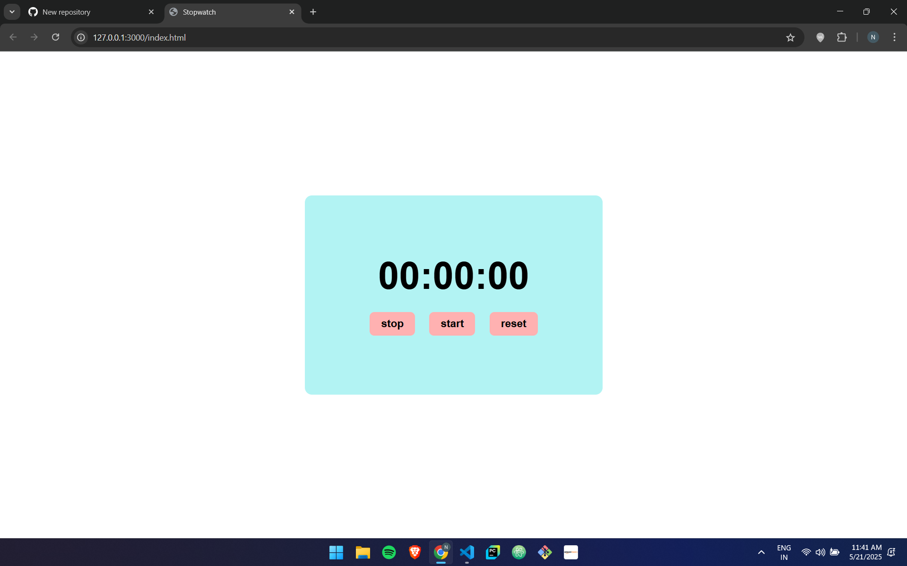

# ⏱️ Simple Stopwatch App

A basic JavaScript Stopwatch that allows you to start, stop, and reset time in `HH:MM:SS` format. Built using HTML, CSS, and vanilla JS.

## 🔧 Features
- Start timer
- Stop/pause timer
- Reset to 00:00:00
- Live time update every second

## 📁 Tech Stack
- HTML
- CSS
- JavaScript (DOM manipulation)

## 🚀 How to Run
1. Clone the repository:
2. Open `index.html` in your browser.

## 📸 Screenshot

---

Made by Nilotpal
